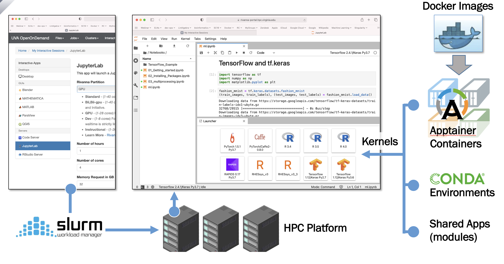
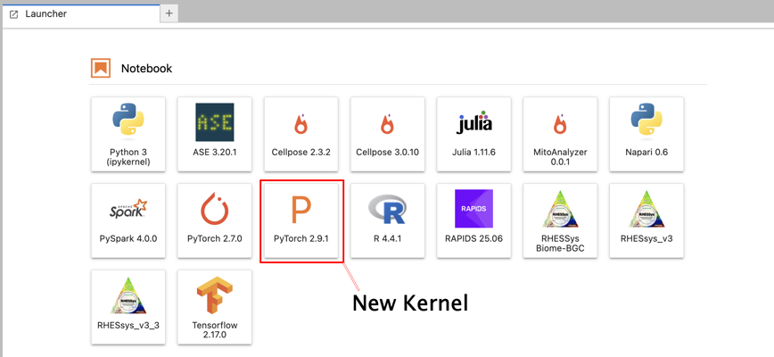

# Containers for Interactive JupyterLab and Batch Computing in HPC Environments

This tutorial explores how containers can provide consistent environments for interactive JupyterLab sessions and non-interactive batch computing, enabling seamless workflows from development to production in HPC environments. The examples are tailored toward use in UVA's HPC environment although the concepts apply generally.

_To follow along you should_

- Have some experience with Linux command-line interfaces and file organization,
- Be familiar with Jupyter notebooks,
- Have basic knowledge of Python,
- Have a basic understanding of software containers. See [Container Basics](https://uvads.github.io/container-basics/) and [Research Computing's Container tutorials](https://learning.rc.virginia.edu/tag/containers/)

> **Note:** It is assumed that you have access to an HPC system. HPC access and user accounts are typically tied to an **allocation**, which is a grant of compute resources that allows you to submit and run jobs on the HPC cluster. At UVA, faculty can request allocations through the [Research Computing](https://www.rc.virginia.edu/userinfo/hpc/). Postdocs, staff and students can be sponsored through a faculty allocation.

## Table of Contents

- [Overview](#overview)
- [Containers in HPC Environments](#containers-in-hpc-environments)
- [Interactive JupyterLab Sessions on an HPC System](#interactive-jupyterlab-sessions-on-an-hpc-system)
- [Running a non-interactive Job](#running-a-non-interactive-job)
- [From Development to Production Environment](#from-development-to-production-environment)
- [References](#references)

## Overview

Containers package application code/executables and all their dependencies needed to run them. They provide lightweight operating system-level virtualization (as opposed to hardware virtualization provided by virtual machines) and offer portability of applications across different environments. Several container projects are specifically targeted at HPC environments, addressing the unique requirements of high-performance computing systems.

When working with code it is helpful to distinguish *interactive* vs *batch (non-interactive)* workloads and *development* vs *production* phases in a software's life cycle.

| | Development | Production |
| --- | --- | --- |
| **Interactive** | Prototyping (e.g. Jupyter notebooks, RStudio) | Data exploration and live analysis (e.g. Jupyter notebooks, RStudio) |
| **Batch** | Testing scripts and analysis at small scale (e.g. scheduled jobs) | Full scale analysis (e.g., scheduled jobs) |

**Development Phase**

There is some tension between the fixed nature of container content and the necessary fluidity of program code as it evolves during the development process. A convenient approach is to containerize all dependencies and mount folders with the evolving code base into the container instance at runtime.

Eventually, the version controlled code base should be included in a new container image based on the image with all its dependencies as base layer. This will become the production image.

**Production Phase**

In the production phase, containers are deployed with the finalized code base included in the image. Both interactive and batch jobs in an HPC environment run on resources allocated by a scheduler, which manages compute node access and resource allocation. The containerized application can be executed consistently across different nodes, ensuring reproducibility and portability of the computational workflow.

## Containers in HPC Environments

Docker requires root-level daemon access, which is typically restricted in HPC environments for security reasons. Several container frameworks have been developed to address this limitation:

<div style="display: flex; align-items: center; margin-bottom: 1em;">
<div style="margin-right: 1em;">

</div>
<div style="flex: 1;">
  <a href="https://apptainer.org/">Apptainer</a> (formerly Singularity): Initially developed at Lawrence Berkeley National Laboratory, now managed through its own foundation. The most widely adopted HPC container solution with support for direct container execution.
</div>
</div>

<div style="display: flex; align-items: center; margin-bottom: 1em;">
<div style="margin-right: 1em;">

</div>
<div style="flex: 1;">
  <a href="https://podman.io/">Podman</a>: Developed by Red Hat. A daemonless container engine that provides a Docker-compatible command-line interface, making it easy to transition from Docker workflows. The `podman-hpc` variant is optimized for HPC environments.
</div>
</div>

<div style="display: flex; align-items: center; margin-bottom: 1em;">
<div style="margin-right: 1em;">

</div>
<div style="flex: 1;">
  <a href="https://github.com/NERSC/shifter">Shifter</a>: Developed at NERSC (National Energy Research Scientific Computing Center). Optimized for large-scale HPC deployments with integration into HPC schedulers and filesystems.
</div>
</div>

<div style="display: flex; align-items: center; margin-bottom: 1em;">
<div style="margin-right: 1em;">

</div>
<div style="flex: 1;">
  <a href="https://charliecloud.io/">CharlieCloud</a>: Developed by Los Alamos National Laboratory. A minimal container runtime with a small footprint, designed for simplicity and ease of deployment.
</div>
</div>

These frameworks are <a href="https://opencontainers.org/">OCI (Open Container Initiative)</a> compatible and can wrap around Docker images at runtime, allowing you to use existing Docker images without modification. This compatibility means you can develop containers using Docker on your local machine and then run them on HPC systems using these user-space frameworks. These frameworks allow users to run containers in HPC environments without requiring administrative privileges, making them suitable for shared computing resources.

**Relevant for Parallel Computing and DL/ML Workloads:**

All of the above frameworks support MPI for parallel computing workloads and provide abstractions that handle GPU hardware access on the host, making them suitable for both traditional HPC workloads and deep learning/machine learning applications that require GPU acceleration.

## Interactive JupyterLab Sessions on an HPC System

JupyterLab is an interactive development environment that provides a web-based interface for working with notebooks, code, and data. It offers a portal that allows users to select a specific app/code environment for their interactive computing sessions. A code environment is defined by its software packages, which are isolated across different environments. These environments are defined and referred to as **kernels**. The isolation of kernels allows you to work with different programming languages, libraries, and tools within the same JupyterLab interface.



You can define your own kernels backed by custom environments, including container images. Here we use it specifically for containerized Python environments, but the concept extends to R, Julia and other supported apps in the Jupyter ecosystem.

In the following steps, we will explore how to define your own kernels backed by custom container images of your choosing. These containerized kernels can then be used for both interactive work in JupyterLab and non-interactive batch job submissions, providing a consistent environment across your workflow.

### 0. Login to the HPC System

It is assumed that you have an account and allocation on an HPC system. Log in to terminal on the HPC login node. On UVA's HPC system you can also open a terminal session in your web browser via the Open OnDemand portal. See [UVA HPC login options](https://www.rc.virginia.edu/userinfo/hpc/login/).

### 1. Get the Container Image

Let's say we want to train an image classifier with PyTorch. DockerHub has a rich repository of PyTorch container images with a variety of versions, <a href="https://hub.docker.com/r/pytorch/pytorch/tags">https://hub.docker.com/r/pytorch/pytorch/tags</a>. Let's pull PyTorch 2.9 with CUDA support so we can utilize GPU acceleration.  

```bash
cd  # go to your home directory
git clone https://github.com/UVADS/jlab-hpc-containers.git

module load apptainer
apptainer pull ~/pytorch-2.9.1.sif docker://pytorch/pytorch:2.9.1-cuda12.6-cudnn9-runtime
```

This will download the PyTorch Docker image and convert it into an Apptainer image file `pytorch-2.9.1.sif` in your current directory (in this case your home directory on the HPC system). The `pytorch-2.9.1.sif` file is self-contained and you can move it around like any other file.

Let's check the Python version.
```bash
apptainer exec ~/pytorch-2.9.1.sif python -V
```

And the PyTorch version:
```bash
apptainer exec ~/pytorch-2.9.1.sif python -c "import torch; print (torch.__version__)"
```

### 2. The ipykernel Package

In order for JupyterLab to detect and run your Python environment as a kernel you need to have the `ipykernel` package installed. Let's run this command to check:
```bash
apptainer exec ~/pytorch-2.9.1.sif python -m ipykernel -V
```

If installed, the ipykernel package will return an output with the version number, e.g.
```
9.6.0
```

### 3. Creating a New Kernel Spec File

In addition to the ipykernel package inside your environment (i.e. inside your container) we need to tell JupyterLab how to launch the kernel environment. These instructions are provided in the kernel spec file that needs to be present on the host system.

JupyterLab searches for kernels in the following order:

1. **User-level directories**: `~/.local/share/jupyter/kernels` (or `~/Library/Jupyter/kernels` on macOS) - kernels specific to your user account
2. **System-wide directories**: `/usr/local/share/jupyter/kernels` or `/usr/share/jupyter/kernels` - kernels available to all users
3. **Environment-specific directories**: `share/jupyter/kernels` within active conda/virtual environments

User-level kernels take precedence over system-wide kernels, allowing you to customize your kernel selection without affecting other users. When creating custom kernels, they are typically placed in `~/.local/share/jupyter/kernels`.

#### 3a. Option A: jkrollout2

On UVA's HPC system you can run the `jkrollout` command to create a new JupyterLab kernel that is backed by a container image (courtesy Ruoshi Sun, UVA Research Computing). We provide an augmented version, `jkrollout2`, in this repo.

Run this command:
```bash
cd ~/jlab-hpc-containers
bash jkrollout2 ~/pytorch-2.9.1.sif "PyTorch 2.9.1" gpu
```
This will create the kernel specifications for the PyTorch container image in `~/.local/share/jupyter/kernels/pytorch-2.9.1`.

-  `kernel.json`
-  `init.sh`

In addition, you will have `~/local/pytorch-2.9.1` where the ipykernel was installed (on the host filesystem, not the container image) which will be dynamically mounted when the Jupyter kernel for PyTorch 2.9.1 is launched.

Skip to step 4.

#### 3b. Option B: Manual Setup

If `ipykernel` is not provided by the container image, we'll augment the Python environment using the following steps:

```bash
mkdir -p ~/local/pytorch-2.9.1
apptainer exec --bind $HOME/local/pytorch-2.9.1:$HOME/.local ~/pytorch-2.9.1.sif python -m pip install --user ipykernel
```

The first line sets up a new directory in home. This will be the destination where the ipykernel package will be installed. You can change the name, just make it unique for each container image.

The second line installs the ipykernel package.

> **Notes:** 
> 
> - The `--bind $HOME/local/pytorch-2.9.1:$HOME/.local` argument will mount the new `$HOME/local/pytorch-2.9.1` directory on the host filesystem and make it available as `$HOME/.local` inside the container instance. 
> 
> - We choose `$HOME/.local` because that's where Python looks for additional packages by default, and that's also the destination for `pip install --user`.

Let's confirm that ipykernel is now available from within the container.
```bash
apptainer exec --bind $HOME/local/pytorch-2.9.1:$HOME/.local ~/pytorch-2.9.1.sif python -m ipykernel -V
```

Note that we have to include the `--bind $HOME/local/pytorch-2.9.1:$HOME/.local` argument in order for this to work.

If the jkrollout/jkrollout2 command is not available, you can create the kernel manually following these steps:

First we'll set up a new directory inside our home directory.

```bash
KERNEL_DIR="~/.local/share/jupyter/kernels/pytorch-2.9.1"
mkdir -p $KERNEL_DIR
cd $KERNEL_DIR
```

Inside this directory we will set up two files, `kernel.json` and `init.sh`. The kernel spec file `kernel.json` is in JSON format and defines the launch command, display name, and display icon in JupyterLab. 

**kernel.json:**
```json
{
 "argv": [
  "/home/mst3k/.local/share/jupyter/kernels/pytorch-2.9.1/init.sh",
  "-f",
  "{connection_file}"
 ],
 "display_name": "PyTorch 2.9.1",
 "language": "python"
}
```

> **Notes:**
> 
> - You cannot use env variables and shell expansion for the `argv` arguments. In other words, `~` or `$HOME` will not work to indicate the path to the script.
> 
> - Replace `mst3k` with your own username on the system. On UVA's systems that's your UVA computing id.
> 
> - We use the `init.sh` script to bundle a few commands, see next step. You can change the name of this launch script.
> 
> - You can customize `display_name` as you wish. That's the name that will show up in the JupyterLab UI.
>   
> - On UVA's HPC system the connection file will be injected at runtime by the JupyterLab instance. You don't need to define that.

The `init.sh` is a short bash script that wraps a few commands together for convenience.
```bash
#!/usr/bin/env bash
. /etc/profile.d/00-modulepath.sh
. /etc/profile.d/rci.sh
nvidia-modprobe -u -c=0

module purge
module load apptainer
apptainer exec --nv --bind $HOME/local/pytorch-2.9.1:$HOME/.local $HOME/pytorch-2.9.1.sif python -m ipykernel $@
```

We need to make the `init.sh` script executable.
```bash
chmod +x init.sh
```

> **Notes:**
> 
> - Lines 2-4 ensure proper setup in case NVIDIA GPUs will be used. 
> 
> - The `--nv` flag ensures that the apps and libraries inside the container have access to the GPU driver on the host.
> 
> - Replace `mst3k` with your username. On UVA's system your username is your computing id.
> 
> - Note the execution of `python -m ipykernel $@` inside the container, including the `$@` which will shell expand command line args you may want to pass on. (Not used here.)
> 
> - The `--bind $HOME/local/pytorch-2.9.1:$HOME/.local` argument can be dropped if the container image provides the ipykernel package.

### 4. Launching the New Kernel

When you now launch JupyterLab, you should see the new `PyTorch 2.9.1` kernel as a new tile in the **Launcher** user interface. On UVA's HPC system you can start [JupyterLab via Open OnDemand](https://www.rc.virginia.edu/userinfo/hpc/software/jupyterlab/).

It should look similar to this.



### 5. A Notebook Example

For this tutorial we will use a [pytorch-example.ipynb](pytorch-example.ipynb) notebook to perform image classification on the MNIST dataset. It's been adapted from example code in the [PyTorch example](https://github.com/pytorch/examples/) repository. 

## Running a non-interactive Job

### 0. Login to the HPC System

It is assumed that you have an account and allocation on an HPC system. Log in to terminal on the HPC login node. On UVA's HPC system you can also open a terminal session in your web browser via the Open OnDemand portal. See [UVA HPC login options](https://www.rc.virginia.edu/userinfo/hpc/login/).

### 1. Get the Container Image

We already pulled the Docker image for PyTorch 2.9.1 and saved it as `pytorch-2.9.1.sif` in our home directory.

### 2. A Python Script Example

For this tutorial we will use an example from the [PyTorch example](https://github.com/pytorch/examples/) repository to perform image classification on the MNIST dataset. 

You can download the code and save it as `pytorch-example.py` with the curl command:
```bash
curl -o pytorch-example.py https://raw.githubusercontent.com/pytorch/examples/refs/heads/main/mnist/main.py
```

### 3. The Job Script

In order to run our Python script on the HPC system we need to write a shell script that specifies the hardware resources and max time limit for the job. On UVA's HPC system job scheduling and resource allocation is handled by [Slurm](https://www.rc.virginia.edu/userinfo/hpc/slurm/). The Slurm resource directives start with `#SBATCH`.

**pytorch-example.sh:**
```bash
#!/bin/bash
#SBATCH --account=<your_allocation>     # replace with your allocation 
#SBATCH --partition=gpu                 
#SBATCH --gres=gpu:1
#SBATCH --mem=32G
#SBATCH --cpus-per-task=4
#SBATCH --time=00:10:00                 # 10 minutes

# get example Py script
curl -o pytorch-example.py https://raw.githubusercontent.com/pytorch/examples/refs/heads/main/mnist/main.py

module purge
module load apptainer
apptainer exec --nv --bind ~/local/pytorch-2.9.1:$HOME/.local ~/pytorch-2.9.1.sif python pytorch-example.py
```

### 4. Running the non-interactive Job

To avoid cluttering our home directory we'll change into a `jobrun` directory in our personal `/scratch` folder. We'll submit the job from there with these commands:
```bash
mkdir -p /scratch/$USER/jobrun      # create new directory in scratch
cd /scratch/$USER/jobrun            # change into that new directory
sbatch ~/jlab-hpc-containers/pytorch-example.sh         # submit the job script
```

We can track status of the submitted job by running the `sacct` command. The job will create a directory `/scratch/$USER/data` where the MNIST dataset will be downloaded to. 

In addition, all stdout and stderr outputs will be redirected to `slurm-*-out` and `slurm-*-err` files in the `jobrun` directory.

The end of the `slurm-*-out` file should look like this, indicating successful training and testing with an accuracy of ~99%:
```
...
Train Epoch: 14 [55680/60000 (93%)]	Loss: 0.065189
Train Epoch: 14 [56320/60000 (94%)]	Loss: 0.000993
Train Epoch: 14 [56960/60000 (95%)]	Loss: 0.113047
Train Epoch: 14 [57600/60000 (96%)]	Loss: 0.029899
Train Epoch: 14 [58240/60000 (97%)]	Loss: 0.002069
Train Epoch: 14 [58880/60000 (98%)]	Loss: 0.036733
Train Epoch: 14 [59520/60000 (99%)]	Loss: 0.023359

Test set: Average loss: 0.0259, Accuracy: 9925/10000 (99%)
```

## From Development to Production Environment

The above steps allow you to augment the packages provided by the container with additional packages installed in a dedicated directory on the host filesystem (e.g. `~/local/pytorch-2.9.1`). We used it to enable Jupyter kernels for a container image that was missing the ipykernel package. In addition, the example notebook, Python script, and job script also existed outside of the container image. This avoids the need to rebuild images for each code iteration and can greatly accelerate the pace during the development cycle.

> With the ultimate goal of reproducible computing, open science, portability and sharing in mind, it is generally recommended to create a new container image when the development cycle is completed. This entails:
> 
> - Version controlling the new code base in GitHub (e.g. the Jupyter notebook, python scripts, job scripts, etc)
> - Exporting the package list from ~/local/pytorch-2.9.1 to `requirements.txt` and adding it to the version controlled repository.
> - Writing a new Dockerfile using the original image (in this example from docker://pytorch/pytorch:2.9.1-cuda12.6-cudnn9-runtime). This Dockerfile should include statements to copy the requirements.txt file and install from that list the needed packages into the new image. The Dockerfile itself should also be added to the repository.

## References

Kurtzer, G. M., Sochat, V., & Bauer, M. W. (2017). Singularity: Scientific containers for mobility of compute. *PLoS ONE*, 12(5), e0177459. <a href="https://doi.org/10.1371/journal.pone.0177459">https://doi.org/10.1371/journal.pone.0177459</a> (Apptainer, formerly Singularity)

Priedhorsky, R., Randles, T., & Olivier, S. L. (2017). Charliecloud: Unprivileged containers for user-friendly HPC. In *Proceedings of the International Conference for High Performance Computing, Networking, Storage and Analysis* (SC '17), Article 50. Association for Computing Machinery. <a href="https://doi.org/10.1145/3126908.3126925">https://doi.org/10.1145/3126908.3126925</a>

Gerhardt, L., Bhimji, W., Canon, S., Fasel, M., Jacobsen, D., Mustafa, M., ... & Yates, B. (2017). Shifter: Containers for HPC. In *Cray User Group Conference* (CUG '17). <a href="https://cug.org/proceedings/cug2017_proceedings/includes/files/pap115s2-file1.pdf">https://cug.org/proceedings/cug2017_proceedings/includes/files/pap115s2-file1.pdf</a>

Walsh, D. (2023). *Podman in Action*. Manning Publications. <a href="https://www.manning.com/books/podman-in-action">https://www.manning.com/books/podman-in-action</a>

Sun, R., & Siller, K. (2024). HPC Container Management at the University of Virginia. In *Practice and Experience in Advanced Research Computing 2024: Human Powered Computing* (PEARC '24), Article 73. Association for Computing Machinery. <a href="https://doi.org/10.1145/3626203.3670568">https://doi.org/10.1145/3626203.3670568</a>

**Additional Resources:**

- <a href="https://apptainer.org/">Apptainer</a> - User Guide and Documentation. Apptainer a Series of LF Projects LLC.
- <a href="https://podman.io/">Podman</a> - Podman Documentation. Red Hat, Inc.
- <a href="https://github.com/NERSC/shifter">Shifter</a> - Shifter Container System. National Energy Research Scientific Computing Center (NERSC).
- <a href="https://charliecloud.io/">CharlieCloud</a> - CharlieCloud Documentation. Los Alamos National Laboratory.